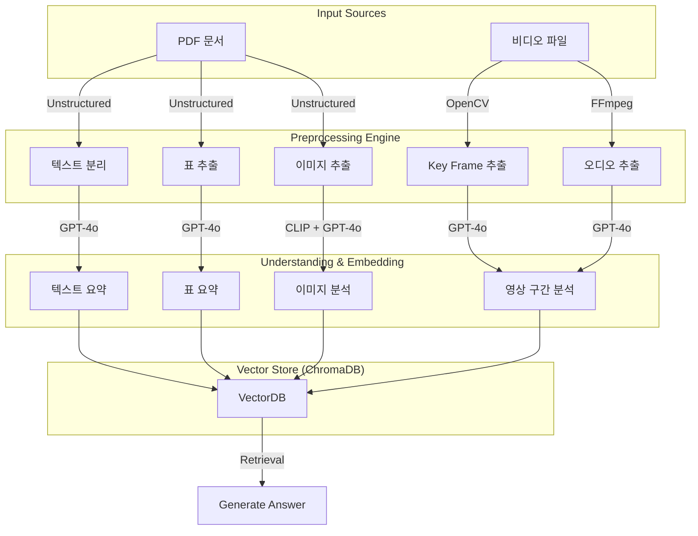

## 📘 Multimodal RAG System
PDF · Image · Video 기반의 멀티모달 RAG 시스템  

  
  
  
  
  
  

## 📖 프로젝트 개요
이 프로젝트는 멀티모달 데이터를 처리하는 RAG(Retrieval-Augmented Generation) 시스템을 처음부터 직접 구현하는 것을 목표로 한다. 
텍스트뿐 아니라 이미지·표가 포함된 PDF, 영상 프레임, 이미지 자체를 분석하여 검색하는 구조를 구축했다. 
PDF/Image/Video → 임베딩 → 벡터DB → 검색 → LLM 응답까지 전체 파이프라인 구성 

## ⭐️ 주요 기능
**1) 멀티모달 데이터 처리 **
	•	PDF (텍스트 + 이미지 + 표) 
	•	이미지 파일 
	•	영상 → 프레임 → 시각 임베딩 

**2) 전체 RAG 파이프라인 구현 **
	•	데이터 전처리 
	•	임베딩 추출 
	•	벡터 DB 저장/검색 
	•	LLM 기반 질의응답 

**3) VideoRAG 프로토타입 구현 **
	•	영상 프레임 추출 
	•	각 프레임 임베딩 후 검색 
	•	쿼리에 따라 관련 프레임 기반 답변 생성 

**4) UI/UX 구현 **
	•	Figma 기반 와이어프레임 제작 
	•	React + Tailwind CSS로 실제 인터페이스 개발 

**5) API 서버 **
	•	FastAPI 기반 API 라우팅 
	•	업로드 → 처리 → 검색 → 응답까지 end-to-end 작업 

**6) Docker 기반 실행 환경 **
	•	프론트/백엔드 컨테이너화 
	•	로컬 및 서버 환경 통일 
 

## Data Pipeline (PDF & Video)

## 시연

**•	PDF 업로드**

**•	사용자 질의**

**•	문서 질의응답과 이미지 출처**

**•	영상 업로드**

**•	영상 질의응답과 출처**

